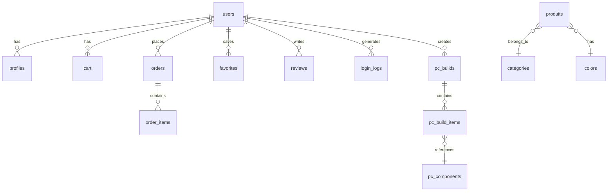

# Alpha Store — Technical Documentation

> **Version:** 1.0 · **Last Updated:** May 2026 · **Authors:** Alpha Store Dev Team

---

## 1. Project Overview & Vision

**Alpha Store** is a multi-sector, AI-powered e-commerce platform built as an academic project (PFA). It serves **Fashion** (Women, Men, Kids, Accessories) and **Tech** (Laptops, Smartphones, Audio, Peripherals, Components, etc.) sectors from a unified storefront.

### Mission

Deliver an intelligent, visually premium shopping experience that leverages classical AI algorithms (BFS, DFS, CSP, Genetic Algorithms) and modern LLM APIs (Gemini) to assist customers with product discovery, outfit coordination, PC building, and budget optimization.

### Competitive Positioning

| Capability | Jumia / Mytek | Alibaba | **Alpha Store** |
|---|---|---|---|
| Multi-sector catalog | ✅ | ✅ | ✅ (Fashion + Tech) |
| AI Recommendations (BFS/DFS) | ❌ | ❌ | ✅ |
| Outfit CSP Solver | ❌ | ❌ | ✅ |
| PC Builder (CSP + GA) | ❌ | ❌ | ✅ |
| Virtual Try-On (IDM-VTON) | ❌ | ❌ | ✅ |
| AI Chatbot (Gemini) | ❌ | Basic | ✅ |
| Smart Budget Optimizer (GA) | ❌ | ❌ | ✅ |
| Gamification (Spin Wheel) | ❌ | ❌ | ✅ |
| GSAP Premium Animations | ❌ | ❌ | ✅ |

---

## 2. Feature Inventory

| # | Feature | AI / Technical Method | User Benefit |
|---|---|---|---|
| 1 | Product Recommendations | BFS + DFS on similarity graph (PHP) | Discover related products by category, color, price |
| 2 | Smart Budget Optimizer | Genetic Algorithm (Python/Flask) | Best product combination within a budget |
| 3 | Mix & Match Outfits | Constraint Satisfaction Problem (Python) | Auto-generated outfit suggestions with color/season/gender harmony |
| 4 | Custom PC Builder | CSP (compatibility) + GA (optimization) | Build a compatible PC with AI-recommended parts |
| 5 | Virtual Try-On | IDM-VTON via HuggingFace API (Python/Flask) | See garments on your own photo |
| 6 | AI Chatbot | Gemini 2.0 Flash API (PHP) | Natural-language product Q&A |
| 7 | AI Chatbot (Flask) | Gemini Web Scrape (Python) | Alternative chatbot via Flask backend |
| 8 | Dynamic Pricing | Minimax / Alpha-Beta Pruning (Python module) | Framework for price negotiation logic |
| 9 | A* Routing | A* Search Algorithm (Python module) | Framework for logistics/pathfinding |
| 10 | Image Search | Google Vision API (planned) | Search products by uploading a photo |
| 11 | Product Reviews | PHP CRUD + star rating | Community-driven product feedback |
| 12 | Favorites / Wishlist | Toggle per user (PHP) | Save products for later |
| 13 | Shopping Cart | Session-backed PHP CRUD | Persistent cart for logged-in users |
| 14 | Order Management | PHP + MySQL | Place orders, track status |
| 15 | User Auth | Bcrypt + OTP email verification | Secure registration, login, password reset |
| 16 | User Dashboard | PHP + JS | Profile management, order history, avatar |
| 17 | Admin Dashboard | Separate PHP app | Product/user/order management |
| 18 | Carnival Spin Game | JS wheel + PHP history | Gamified daily rewards |
| 19 | Animated Homepage | GSAP + Swiper.js | Premium, dynamic browsing experience |
| 20 | Product Filtering | PHP + JS | Multi-category, price range, sort |

---

## 3. Tech Stack & Dependencies

### Backend

| Tool | Role |
|---|---|
| **PHP 8.2** (Apache/XAMPP) | Main backend — routing, controllers, models |
| **MariaDB 10.4** | Primary database |
| **PDO** | Database abstraction layer |
| **vlucas/phpdotenv ^5.6** | Environment variable loading |
| **PHPMailer ^7.0** | SMTP email (OTP verification, password reset) |
| **Flask (Python)** | AI microservices (port 5001) |
| **Flask-CORS** | Cross-origin support for Flask APIs |
| **mysql-connector-python** | Python ↔ MySQL bridge |

### Frontend

| Tool | Role |
|---|---|
| **Vanilla JS (ES6+)** | Core application logic |
| **GSAP** | Hero slider, page transitions, scroll animations |
| **Swiper.js** | Product carousels, landing slider |
| **Bootstrap 5.3** | Grid layout, utility classes |
| **Font Awesome 6 + Remix Icon** | Icon libraries |
| **Google Fonts** | Montserrat, Lato, Poppins, DM Sans, Playfair Display |

### AI / ML

| Tool | Role |
|---|---|
| **Gemini 2.0 Flash API** | LLM chatbot (via PHP cURL) |
| **@google/generative-ai** | Node.js Gemini SDK (available) |
| **HuggingFace Inference API** | IDM-VTON virtual try-on |
| **Custom Python modules** | BFS, DFS, A*, Alpha-Beta, GA, CSP solvers |

### DevOps

| Tool | Role |
|---|---|
| **XAMPP** | Local Apache + MySQL server |
| **Git** | Version control |
| **XSStrike** | XSS vulnerability testing (included in repo) |
| **JMeter** | Load testing (steps documented) |

---

## 4. Frontend Architecture

### Page Structure

```
View/
├── html/                    # All HTML/PHP pages
│   ├── index.html           # Main homepage (73KB, animated)
│   ├── tech.html            # Tech store (71KB)
│   ├── Adult.php            # Adult fashion catalog
│   ├── Men1.html            # Men's collection
│   ├── Women1.html          # Women's collection
│   ├── Kid1.html            # Kids' collection
│   ├── product_details.php  # Product detail page
│   ├── checkout.php         # Checkout flow
│   ├── signUp.php           # Registration + Login
│   ├── ai.html              # AI features hub
│   ├── smart-suggestion.php # GA budget optimizer UI
│   ├── smart-budget.html    # Smart budget page
│   ├── mix-match.php        # Outfit CSP UI
│   ├── pc-builder.php       # PC Builder UI
│   ├── store.html           # General store page
│   ├── 404.html             # Custom error page
│   ├── AboutUs.html         # About page
│   ├── contactUs.html       # Contact page
│   └── news.html            # News/blog page
├── css/                     # 34+ stylesheets
├── javaScript/              # 34 JS modules
├── spin/                    # Carnival spin game
├── user_Dashboard/          # User account dashboard
└── img/                     # Static images
```

### Animation System

| Library | Usage |
|---|---|
| **GSAP (GreenSock)** | Hero slider transitions, parallax scrolling, page entrance animations, FLIP animations for product grids |
| **Swiper.js** | Touch-enabled product carousels, landing page slider with thumbnail navigation |
| **CSS Keyframes** | Brand logo marquee, countdown timer pulse, hover micro-interactions |
| **Intersection Observer** | Scroll-triggered section reveals |

### Key JavaScript Modules

| File | Purpose |
|---|---|
| `new_front.js` | Homepage hero slider with GSAP timeline orchestration |
| `carts.js` | Cart CRUD, quantity sync, sidebar UI |
| `shop.js` | Product grid rendering, filtering, pagination |
| `chatbot.js` | Gemini chatbot UI with markdown rendering |
| `review.js` | Star-rating widget, review submission and display |
| `pc-builder.js` | PC component selection, CSP filtering, GA recommendations |
| `mix-match.js` | Outfit CSP integration, solution carousel |
| `smart-suggestion.js` | GA budget optimizer with fitness chart |
| `TryOn.js` | Virtual try-on with image upload to HuggingFace |
| `tech.js` | Tech store rendering, filtering, comparison |
| `animationOrder.js` | Order placement animation sequence |
| `spin.js` | Wheel spin logic, prize calculation, history tracking |

---

## 5. Backend Architecture

### Routing

All requests route through `index.php` via `.htaccess` rewrite rules. The router dispatches on `$_GET['action']`:

```php
// .htaccess
RewriteEngine On
RewriteCond %{REQUEST_FILENAME} !-f
RewriteCond %{REQUEST_FILENAME} !-d
RewriteRule . index.php [L]
```

### MVC Pattern

```
AlphaStore/
├── index.php              # Front controller / router
├── config/
│   └── Database.php       # PDO connection (env-driven)
├── Controller/            # 12 controllers (procedural PHP functions)
├── model/                 # 11 models (class-based, PDO)
├── services/
│   ├── mailer.php         # PHPMailer wrapper
│   ├── ai/                # Flask AI microservice
│   └── chatBot_flask/     # Alternative chatbot service
└── View/                  # Frontend assets
```

### Controller Summary

| Controller | Responsibilities |
|---|---|
| `AuthController` | Registration, login (bcrypt), OTP verification, password reset |
| `ProduitController` | Fashion product CRUD, filtering, image retrieval |
| `ProduitTechController` | Tech product CRUD, filtering, detail views |
| `CartController` | Add/remove/update cart items (session-gated) |
| `OrderController` | Place orders, retrieve order history + details |
| `RecommendationController` | BFS/DFS product recommendation engine |
| `ChatbotController` | Gemini API proxy with product catalog context |
| `PCBuildController` | Proxy to Flask CSP/GA endpoints |
| `ReviewController` | Add/list product reviews |
| `FavoriteController` | Toggle favorites per user |
| `ProfileController` | Update user profile (name, age, gender, avatar) |
| `SpinController` | Save/retrieve spin game history |

### Flask AI Microservice (`services/ai/app.py` — Port 5001)

| Endpoint | Method | Purpose |
|---|---|---|
| `/api/optimize` | POST | GA budget optimizer |
| `/api/mix-match` | POST | Outfit CSP solver |
| `/api/pc-components` | GET | All PC parts grouped by type |
| `/api/pc-filter` | POST | CSP compatibility filter |
| `/api/pc-recommend` | POST | GA PC build recommendation |
| `/api/health` | GET | Service health check |

### TryOn Service (`TryOn_py/files/app.py` — Port 5000)

| Endpoint | Method | Purpose |
|---|---|---|
| `/tryon` | POST | Virtual try-on via HuggingFace IDM-VTON |

---

## 6. AI Modules

### 6.1 Product Recommendations (BFS + DFS)

- **Location:** `Controller/RecommendationController.php`
- **Algorithm:** Builds a weighted similarity graph across all products. Edge weight = similarity score (category: +30, color: +25, price proximity ≤10$: +20, in-stock: +5). BFS finds nearest neighbors; DFS finds a deep exploration chain.
- **Input:** `product_id`, `type` (regular/tech), `limit`
- **Output:** JSON with `recommendations[]` and `dfsChain[]`
- **Limitations:** O(n²) graph construction; no collaborative filtering

### 6.2 Smart Budget Optimizer (Genetic Algorithm)

- **Location:** `services/ai/genetic_optimizer.py`
- **Algorithm:** Binary GA (population=50, generations=350, mutation=0.1, crossover=0.7). Fitness = score + variety_bonus + budget_usage. Elitism + tournament selection. Early stopping after 100 stagnant generations.
- **Input:** `budget`, `category` (optional), `user_id` (optional for cart-based optimization)
- **Output:** `best_combination[]`, `total_price`, `total_score`, `history[]`
- **Limitations:** Score heuristic is basic (stock > 10 → +1, price < 50 → +2)

### 6.3 Mix & Match Outfits (CSP)

- **Location:** `services/ai/csp_mix_match.py`
- **Algorithm:** Backtracking search with Forward Checking. Variables = clothing slots (haut, bas, chaussure, accessoire). Constraints: budget, color compatibility (custom matrix with neutral colors), season compatibility, gender/category consistency.
- **Input:** `product_id` (anchor), `budget`, `season`
- **Output:** Up to 5 scored outfit solutions with items and totals
- **Limitations:** Hardcoded color compatibility matrix; no learning from user preferences

### 6.4 PC Builder — Compatibility (CSP)

- **Location:** `services/ai/pc_csp.py`
- **Algorithm:** Arc-consistency style filtering. Constraints: CPU socket ↔ motherboard, RAM type (DDR4/DDR5) ↔ motherboard, RAM slots, case form factor (ATX/mATX/ITX), GPU clearance length, PSU wattage (≥ TDP × 1.2), budget, stock.
- **Input:** `selected` components, `budget`
- **Output:** Annotated domains per component type (`ok`, `reason`, `selected`)
- **Limitations:** No cooling/airflow constraints; no NVMe slot count validation

### 6.5 PC Builder — Recommendation (GA)

- **Location:** `services/ai/pc_genetic.py`
- **Algorithm:** Integer-encoded GA (population=60, generations=200). Profile-weighted fitness (e.g., gaming: GPU=0.40, CPU=0.30). Budget utilization bonus. CSP-filtered domains as input.
- **Input:** `selected`, `budget`, `usage_profile` (gaming/workstation/budget/streaming)
- **Output:** `recommended{}` components, `total_recommended_price`, `fitness_history[]`
- **Limitations:** Small component catalog (26 items); no real benchmark data

### 6.6 AI Chatbot (Gemini)

- **Location:** `Controller/ChatbotController.php`
- **Algorithm:** RAG-lite — injects full product catalog as context into Gemini 2.0 Flash prompt.
- **Input:** User message (JSON)
- **Output:** AI-generated response in French
- **Limitations:** Context window limited by catalog size; no conversation memory

### 6.7 Virtual Try-On

- **Location:** `TryOn_py/files/app.py` + `View/javaScript/TryOn.js`
- **Algorithm:** IDM-VTON model via HuggingFace Inference API
- **Input:** User photo + garment image
- **Output:** Composite image showing garment on user
- **Limitations:** API rate limits; quality depends on input photo

### 6.8 Classic Algorithms (Framework)

- **Location:** `services/ai/classic_algorithms.py`
- **Modules:** `SearchAlgorithms` (BFS, DFS, A*), `GameTheoryAlgorithms` (Minimax with Alpha-Beta)
- **Status:** Implemented as reusable classes; A* and Alpha-Beta not yet integrated into live endpoints

---

## 7. Data Models

### Entity-Relationship Overview



### Table Schemas

| Table | Key Columns | Notes |
|---|---|---|
| **users** | `id`, `name`, `email`, `password` (bcrypt), `role` (admin/customer), `is_verified`, `verification_code`, `reset_token_hash` | Email unique; OTP verification flow |
| **profiles** | `id`, `user_id` FK, `firstname`, `lastname`, `phone`, `gender`, `age`, `avatar` | 1:1 with users |
| **produits** | `id` (varchar, e.g. GAP-001), `name`, `price`, `stock`, `image_path`, `category_id` FK, `color_id` FK, `product_type`, `season` | Fashion products (56 items) |
| **produits_t** | `id` (int), `name`, `price`, `stock`, `image_path`, `category`, `color` | Tech products (25 items) |
| **categories** | `id`, `name` | Femme, Homme, Enfant, Accessoires, Smartphones, etc. (15 categories) |
| **colors** | `id`, `name` | 24 color options |
| **cart** | `id`, `user_id` FK, `produit_id` FK, `quantite` | Session-gated |
| **orders** | `id`, `user_id` FK, `total_price`, `status` (pending/paid/shipped/delivered/cancelled) | |
| **order_items** | `id`, `order_id` FK, `product_id` FK, `quantity`, `price` | |
| **favorites** | `id`, `user_id` FK, `product_id` FK | Unique per user+product |
| **reviews** | `id`, `user_id` FK, `product_id` FK, `rating` (0-5), `comment`, `status` (pending/approved/rejected) | |
| **login_logs** | `id`, `user_id` FK, `email`, `status` (success/failed) | Audit trail |
| **pc_components** | `id`, `name`, `component_type` (cpu/gpu/mobo/ram/psu/storage/case), `brand`, `price`, `performance_score`, `tdp`, `socket`, `form_factor`, `ram_type`, `wattage`, `gpu_length`, `specs` (JSON) | 26 components |
| **pc_builds** | `id`, `user_id` FK, `name`, `total_price`, `usage_profile` | |
| **pc_build_items** | `id`, `build_id` FK, `component_id` FK | |

---

## 8. API Endpoints

### PHP Router (`index.php?action=`)

| Action | Method | Description | Request | Response |
|---|---|---|---|---|
| `getProduits` | GET | All fashion products | — | `[{id, name, price, ...}]` |
| `getProduitByCategory` | GET | Filter by category | `?category=Femme&minPrice=10&maxPrice=50&sortBy=price_asc` | `[{...}]` |
| `getProduitById` | GET | Single product | `?id=GAP-001` | `{id, name, ...}` |
| `getAllimage` | GET | Product images | `?id=GAP-001` | `[{image_path}]` |
| `getTechProduits` | GET | All tech products | — | `[{...}]` |
| `getTechProduitByCategory` | GET | Filter tech | `?category=Smartphones` | `[{...}]` |
| `getTechProduitById` | GET | Single tech product | `?id=1` | `{...}` |
| `getTechProduitDetail` | GET | Tech detail + images | `?id=1` | `[{..., images:[]}]` |
| `getRecommendations` | GET | BFS/DFS recommendations | `?id=GAP-001&type=regular` | `{recommendations:[], dfsChain:[]}` |
| `addToCart` | POST | Add to cart | `productID, quantity` | `{status: "success"}` |
| `getCart` | GET | User's cart | — | `[{produit_id, quantite, ...}]` |
| `removeFromCart` | POST | Remove item | `productID` | `{status: "success"}` |
| `updateQuantity` | POST | Update qty | `productID, quantity` | `{status: "success"}` |
| `chatbot` | POST | AI chatbot | `{message: "..."}` (JSON) | `{response: "..."}` |
| `addReview` | POST | Submit review | `{productId, rating, title, body}` (JSON) | `{success: true}` |
| `getAllReview` | GET | Product reviews | `?productId=GAP-001` | `{success, data:[]}` |
| `toggleFavorite` | POST | Add/remove fav | `product_id` | `{status: "added"/"removed"}` |
| `getFavorites` | GET | User favorites | — | `[{...}]` |
| `updateProfile` | POST | Update profile | `{firstName, lastName, age, phone, gender, avatar}` (JSON) | `{success: true}` |
| `getPCComponents` | GET | All PC parts | — | `{cpu:[], gpu:[], ...}` |
| `filterPCComponents` | POST | CSP filter | `{selected:{}, budget:N}` (JSON) | `{cpu:[{component, ok, reason}], ...}` |
| `getPCRecommendation` | POST | GA recommend | `{selected:{}, budget:N, usage_profile:"gaming"}` (JSON) | `{recommended:{}, total_recommended_price, fitness_history}` |
| `saveSpin` | POST | Save spin result | `prize_label, prize_number, is_win` | `{success: true}` |
| `getSpinHistory` | GET | Spin history | — | `{success, history:[]}` |
| `verif_code` | POST | OTP verification | `email, code` | Redirect |

### Flask AI Endpoints (Port 5001)

| Route | Method | Body | Response |
|---|---|---|---|
| `/api/optimize` | POST | `{budget, category?, user_id?}` | `{best_combination, total_price, total_score, history}` |
| `/api/mix-match` | POST | `{product_id, budget, season?}` | `[{items, total, score}]` |
| `/api/pc-components` | GET | — | `{cpu:[], gpu:[], ...}` |
| `/api/pc-filter` | POST | `{selected:{}, budget}` | `{cpu:[{component, ok, reason}], ...}` |
| `/api/pc-recommend` | POST | `{selected:{}, budget, usage_profile}` | `{recommended:{}, total_recommended_price, fitness_history}` |
| `/api/health` | GET | — | `{status:"healthy"}` |

---

## 9. Environment Variables

```env
# Database
DB_HOST=localhost
DB_NAME=alphastore
DB_USER=root
DB_PASS=''

# App
APP_ENV=development
APP_URL=http://localhost/AlphaStore

# Mail (PHPMailer / SMTP)
MAIL_HOST=smtp.gmail.com
MAIL_PORT=587
MAIL_USERNAME=<gmail_address>
MAIL_PASSWORD=<app_password>
MAIL_FROM_NAME=AlphaStore

# Virtual Try-On (HuggingFace)
API_key_1=hf_xxxxx
API_key_2=hf_xxxxx

# Chatbot (Gemini) — used by ChatbotController.php
API_GEMINI=<gemini_api_key>
```

---

## 10. UI/UX Design System

### Typography

| Font | Usage | Weight |
|---|---|---|
| **Montserrat** | Headlines, hero text | 400–700 |
| **Poppins** | Section titles, UI labels | 300–700 |
| **Lato** | Body text, descriptions | 400, 700, 900 |
| **DM Sans** | Product cards, subtle UI | 400, 500 |
| **Playfair Display** | Accent / editorial sections | 400, 700 |

### Color Palette

| Context | Colors |
|---|---|
| Primary Brand | Deep blacks, whites, warm oranges |
| Hero Gradients | `#FE783D → #121826`, `#00499D → #121826`, `#DAB1C8 → #511990` |
| Tech Section | Dark mode with neon accents |
| Fashion Section | Neutral earth tones, soft pastels |
| Accent / CTA | `#007bff` (Bootstrap primary), `#2563eb` |
| Backgrounds | `#f4f6f9`, `#121826`, `#1a1a2e` |

### Animation Conventions

| Pattern | Implementation |
|---|---|
| Page entrance | GSAP timeline with staggered reveals |
| Hero slider | GSAP with FLIP transitions between slides |
| Product hover | CSS transform scale + shadow elevation |
| Scroll reveal | Intersection Observer + GSAP `fromTo` |
| Brand marquee | CSS infinite `translateX` animation |
| Loading screen | Animated progress bar with brand name |
| Cart sidebar | CSS slide-in transition |
| Countdown timer | JS interval with CSS pulse on digits |

---

## 11. Deployment Guide

### Prerequisites

- XAMPP (Apache + MySQL/MariaDB)
- PHP 8.2+
- Python 3.10+
- Composer
- Node.js / npm (optional)

### Step-by-Step

```bash
# 1. Clone the project into XAMPP htdocs
git clone <repo> c:\xampp\htdocs\AlphaStore

# 2. Install PHP dependencies
cd c:\xampp\htdocs\AlphaStore
composer install

# 3. Configure environment
cp .env.example .env   # Edit with your DB and API credentials

# 4. Import database
# Open phpMyAdmin → Import → Select alphastore.sql
# Then run: pc_components_migration.sql, spin_history_migration.sql

# 5. Start XAMPP (Apache + MySQL)

# 6. Install Python AI service dependencies
cd services/ai
pip install -r requirements.txt

# 7. Start Flask AI service
python app.py    # → http://localhost:5001

# 8. (Optional) Start Virtual Try-On service
cd TryOn_py/files
pip install -r requirements.txt
python app.py    # → http://localhost:5000

# 9. Access the application
# → http://localhost/AlphaStore
```

### Services Summary

| Service | Port | Command | Required For |
|---|---|---|---|
| Apache/XAMPP | 80 | XAMPP Control Panel | Main application |
| MySQL | 3306 | XAMPP Control Panel | Database |
| Flask AI | 5001 | `python services/ai/app.py` | Budget optimizer, Mix & Match, PC Builder |
| TryOn Flask | 5000 | `python TryOn_py/files/app.py` | Virtual Try-On |
| Flask Chatbot | 5003 | `python services/chatBot_flask/app.py` | Optional alternative chatbot |

---

## 12. Roadmap & Known Issues

### Planned Features

- [ ] Collaborative filtering for recommendations (user behavior-based)
- [ ] A* algorithm integration for logistics/delivery routing
- [ ] Alpha-Beta pricing negotiation UI
- [ ] Google Vision API image search
- [ ] Payment gateway integration (Stripe / Flouci)
- [ ] Multi-language support (FR/EN/AR)
- [ ] PWA offline support
- [ ] Real-time inventory sync with WebSockets
- [ ] Admin dashboard integration with main app auth

### Known Issues

| Issue | Severity | Notes |
|---|---|---|
| `produits_t` uses different schema than `produits` (no FK for category/color) | Medium | Tech products use inline strings instead of FK relations |
| Recommendation graph is O(n²) | Low | Acceptable for current catalog size (~80 products) |
| Flask chatbot and AI service share port 5001 | Medium | Must change port if running both |
| Cart only supports `produits` table (fashion), not `produits_t` (tech) FK constraint | Medium | Cart FK references `produits(id)` only |
| SSL verification disabled in cURL calls | Low | `CURLOPT_SSL_VERIFYPEER = false` in chatbot |
| No CSRF protection on POST endpoints | Medium | Action-based routing lacks token validation |
| `database.py` has SQL injection risk in category filter | High | Uses f-string interpolation instead of parameterized queries |
| Session fixation partially mitigated | Low | `session_regenerate_id(true)` only on login |

---

*Generated from codebase analysis — Alpha Store v1.0*
