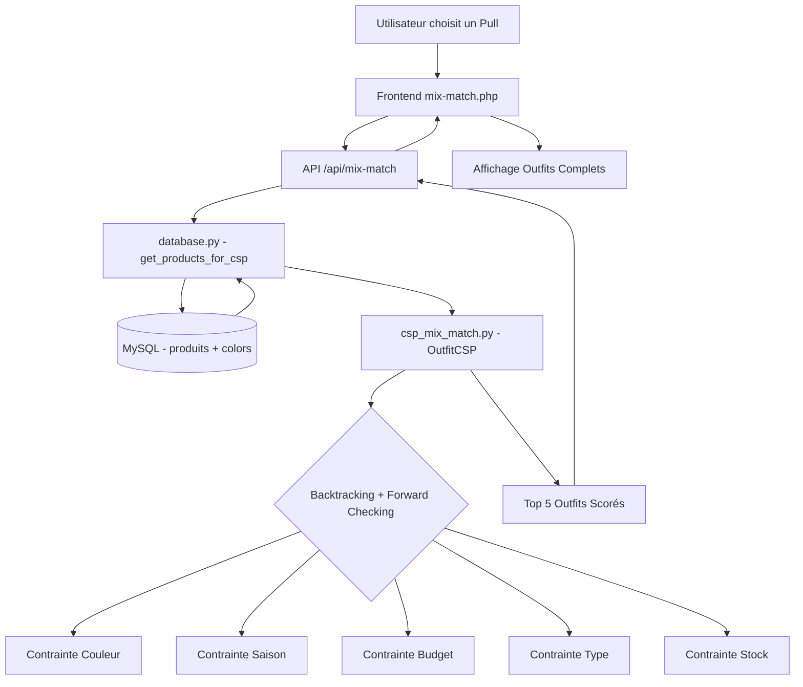

# 🧩 CSP Mix & Match — Système de Recommandation d'Outfits

## Problème identifié

Dans le e-commerce traditionnel, quand un utilisateur aime un **pull**, il doit manuellement chercher dans la section pantalons pour trouver un pantalon assorti, puis dans les chaussures, etc. Les solutions existantes (collections figées) sont limitées : chaque pull n'est associé qu'à un seul pantalon.

## Solution proposée : CSP (Constraint Satisfaction Problem)

Un solveur CSP avec **backtracking + propagation de contraintes** qui, à partir d'une pièce sélectionnée par l'utilisateur, trouve automatiquement des pièces complémentaires assorties selon des règles définies.

### Variables CSP
| Variable | Domaine |
|----------|---------|
| `haut` (top) | Tous les hauts du catalogue (pulls, chemises, t-shirts, débardeurs) |
| `bas` (bottom) | Tous les bas (pantalons, shorts, jupes) |
| `accessoire` | Tous les accessoires (sacs, sandales, etc.) |

### Contraintes définies
| Contrainte | Règle | Exemple |
|------------|-------|---------|
| **Couleur compatible** | Matrice de compatibilité couleur | Noir ↔ tout ✅, Vert ↔ Rouge ❌ |
| **Saison cohérente** | Les pièces doivent convenir à la même saison | Pas de manteau + short |
| **Type complet** | L'outfit doit contenir des types complémentaires | haut + bas + accessoire |
| **Budget** | Le total ne doit pas dépasser le budget utilisateur | Total ≤ budget |
| **Disponibilité** | Les pièces doivent être en stock | stock > 0 |
| **Genre** | Les pièces doivent être pour le même genre | Femme + Femme ✅ |

---

## User Review Required

> [!IMPORTANT]
> **Enrichissement de la base de données** : Les produits actuels dans `produits` n'ont pas de colonne `product_type` (haut/bas/accessoire/ensemble) ni `season` (été/hiver/toutes_saisons). Il faudra :
> 1. Ajouter ces colonnes via une migration SQL
> 2. Classifier les 56 produits existants (je peux le faire automatiquement en analysant les noms des produits)
>
> Est-ce que vous acceptez cette modification du schéma ?

> [!WARNING]
> **Produits de type "Ensemble"** : Certains produits comme `GAP-001 (Ensemble chemise et short)` ou `GAP-040 (Ensemble chemise pantalon)` sont déjà des outfits complets. Le CSP les traitera comme des pièces uniques (type `ensemble`) et ne cherchera à compléter qu'avec un accessoire.

---

## Open Questions

1. **Météo en temps réel** : Voulez-vous intégrer une API météo (ex: OpenWeatherMap gratuit) pour filtrer par saison selon la météo actuelle ? Ou simplement un sélecteur manuel de saison ?

2. **Cross-marque** : Vos produits sont tous "GAP". Prévoyez-vous d'ajouter d'autres marques à l'avenir ? Le CSP est déjà conçu pour supporter le cross-marque.

3. **Page d'intégration** : Où voulez-vous afficher le Mix & Match ?
   - **Option A** : Nouvelle section dans `ai.html` (à côté du Virtual Try-On et du Comparateur)
   - **Option B** : Nouvelle page dédiée `mix-match.php`
   - **Option C** : Widget sur `product_details.php` (quand l'utilisateur regarde un produit)

---

## Proposed Changes

### Component 1 : Database Enrichment

#### [MODIFY] [alphaStoreDb.sql](file:///c:/xampp/htdocs/AlphaStore/alphaStoreDb.sql)

Ajouter les colonnes `product_type` et `season` à la table `produits` :

```sql
ALTER TABLE produits 
  ADD COLUMN product_type ENUM('haut','bas','accessoire','chaussure','ensemble') DEFAULT NULL,
  ADD COLUMN season ENUM('ete','hiver','mi_saison','toutes_saisons') DEFAULT 'toutes_saisons';
```

Classification automatique basée sur les noms existants :
```
haut       → Pull, Chemise, T-shirt, Débardeur, Top, Haut, Surchemise, Veste
bas        → Pantalon, Short, Jupe
accessoire → Sac, Sandales
ensemble   → Ensemble
```

---

### Component 2 : CSP Solver (Python Backend)

#### [NEW] [csp_mix_match.py](file:///c:/xampp/htdocs/AlphaStore/services/ai/csp_mix_match.py)

Le cœur du système — un solveur CSP from scratch :

```
class OutfitCSP:
    ├── __init__(anchor_product, all_products, constraints)
    ├── define_variables()      # Détermine les slots à remplir
    ├── define_domains()        # Produits candidats par slot
    ├── is_consistent()         # Vérifie toutes les contraintes
    ├── backtrack_search()      # Algorithme de backtracking
    ├── propagate_constraints() # Forward checking (AC-3 simplifié)
    └── solve(max_solutions=5)  # Retourne les N meilleures combinaisons

class ColorCompatibility:
    ├── COMPATIBILITY_MATRIX    # Matrice de compatibilité couleur
    ├── NEUTRAL_COLORS          # {Noir, Blanc, Beige, Gris}
    └── are_compatible(c1, c2)  # Vérification couleur

class SeasonConstraint:
    ├── SEASON_MAP              # Mapping produit → saison
    └── are_compatible(s1, s2)  # Vérification saison
```

**Algorithme** :
1. L'utilisateur sélectionne un produit "ancre" (ex: Pull Rose fuchsia GAP-042)
2. Le CSP identifie le type (haut) → il doit trouver un `bas` et un `accessoire`
3. Backtracking avec forward checking :
   - Filtre par genre compatible
   - Filtre par couleurs compatibles avec le rose fuchsia (→ Noir, Blanc, Beige)
   - Filtre par saison compatible
   - Filtre par budget restant
4. Score chaque solution (diversité couleur + harmonie + popularité)
5. Retourne les top 5 outfits

---

### Component 3 : Database Access Layer

#### [MODIFY] [database.py](file:///c:/xampp/htdocs/AlphaStore/services/ai/database.py)

Ajouter une nouvelle fonction `get_products_for_csp()` qui récupère les produits avec leurs types et couleurs pour le solveur CSP :

```python
def get_products_for_csp(anchor_product_id=None):
    """Fetch products with color names, product_type, and season for CSP solver"""
    # JOIN avec colors pour avoir les noms de couleur
    # Inclut product_type et season
    # Filtre par stock > 0
```

---

### Component 4 : API Endpoint

#### [MODIFY] [app.py](file:///c:/xampp/htdocs/AlphaStore/services/ai/app.py)

Ajouter l'endpoint `/api/mix-match` :

```python
@app.route('/api/mix-match', methods=['POST'])
def mix_match():
    data = request.json
    anchor_id = data.get('product_id')      # Produit sélectionné
    budget = float(data.get('budget', 150))  # Budget max
    season = data.get('season', None)        # Filtre saison optionnel
    gender = data.get('gender', None)        # Genre cible
    
    # → Appelle le CSP solver
    # → Retourne les outfits recommandés
```

---

### Component 5 : Frontend — Page Mix & Match

#### [NEW] [mix-match.php](file:///c:/xampp/htdocs/AlphaStore/View/html/mix-match.php)

Page premium avec :
- **Sélecteur de pièce ancre** : L'utilisateur choisit un produit qu'il aime
- **Filtres** : Budget, saison, genre
- **Résultats visuels** : Cards d'outfits complets avec toutes les pièces affichées
- **Score de compatibilité** : Indicateur visuel de la qualité de l'assortiment
- **Bouton "Ajouter tout au panier"**

#### [NEW] [mix-match.css](file:///c:/xampp/htdocs/AlphaStore/View/css/mix-match.css)

Design premium avec :
- Glassmorphism cards pour chaque outfit
- Animation de "reveal" des pièces suggérées
- Gradient badges pour le score de compatibilité
- Grid responsive pour les outfits
- Dark mode cohérent avec le reste du site

#### [NEW] [mix-match.js](file:///c:/xampp/htdocs/AlphaStore/View/javaScript/mix-match.js)

Logique frontend :
- Fetch des produits pour le sélecteur
- Appel API `/api/mix-match`
- Rendu dynamique des résultats
- Animations de chargement et de transition

---

## Architecture



---

## Verification Plan

### Automated Tests
1. **Test unitaire du CSP** : Script Python qui vérifie :
   - Un pull rose → ne suggère jamais un pantalon vert/rouge
   - Un produit hiver → ne suggère jamais un short
   - Le budget est toujours respecté
   - Tous les produits retournés sont en stock

2. **Test de l'API** : Appel curl/Postman au endpoint avec différents produits ancre

### Manual Verification
- Lancer la page dans le navigateur
- Sélectionner différents produits et vérifier visuellement la cohérence des suggestions
- Tester avec différents budgets
