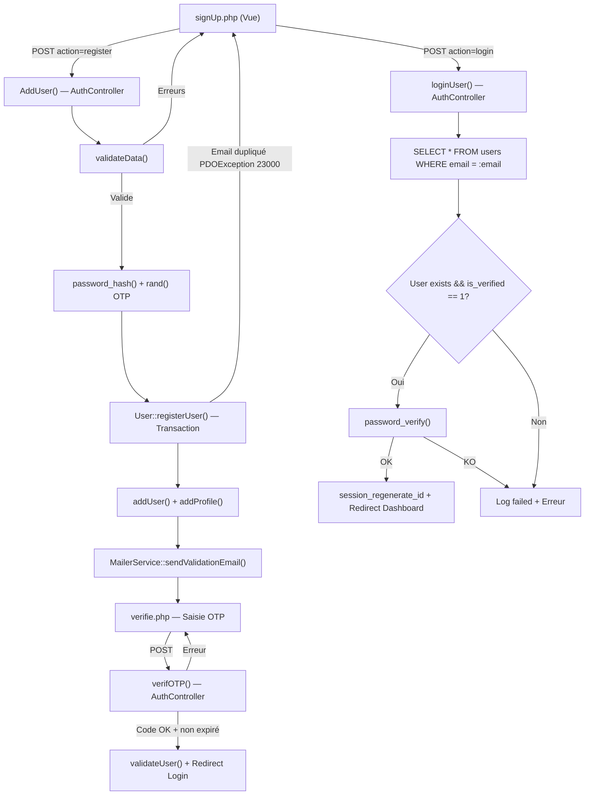
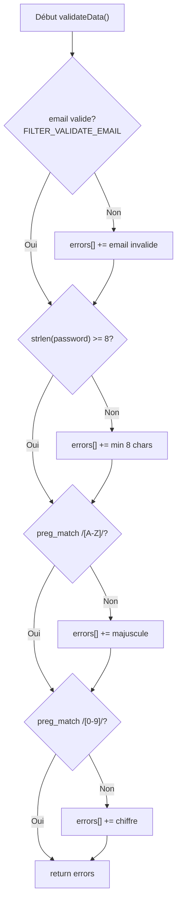
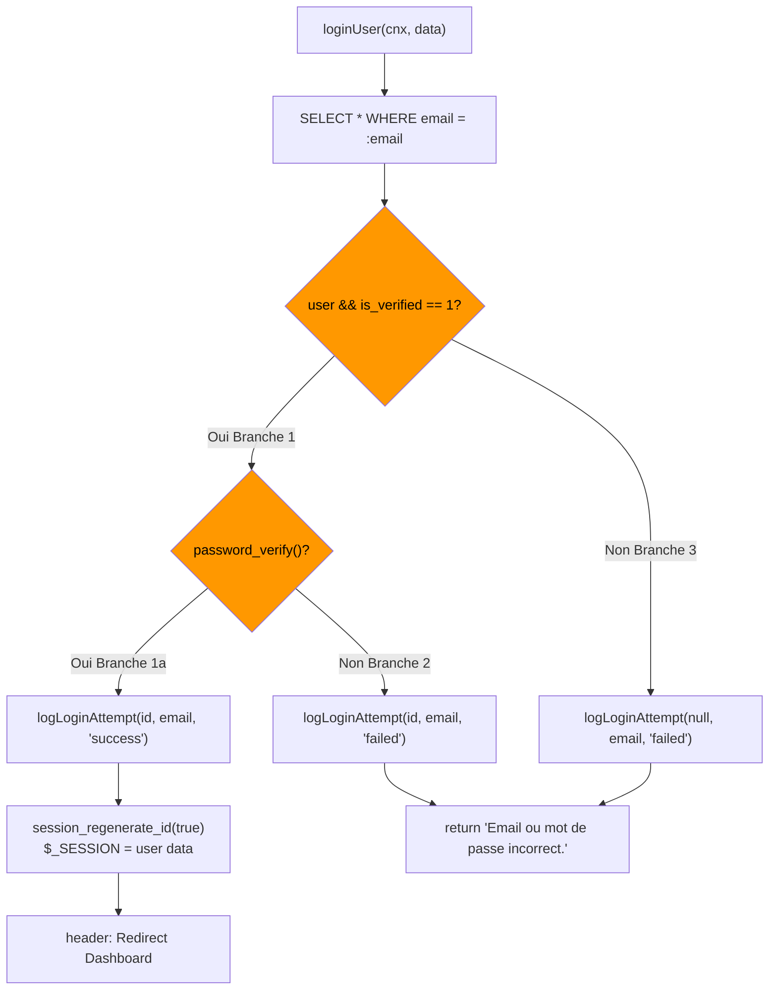

# 📋 Plan de Test — Login & Signup (AlphaStore)

> **Projet** : AlphaStore — Application e-commerce PHP/MySQL  
> **Module testé** : Authentification (Inscription + Connexion + Vérification OTP)  
> **Fichiers concernés** : `AuthController.php`, `User.php`, `LoginLog.php`, `signUp.php`, `verifie.php`  
> **Date** : 19/05/2026

---

## 1. Architecture du Module d'Authentification

---

## 2. Tests Boîte Blanche (White-Box Testing)

> **Objectif** : Tester la structure interne du code en se basant sur le flux de contrôle, les branches conditionnelles et la couverture du code source.

### 2.1 Analyse de la fonction `validateData()` — [AuthController.php:8-29](file:///c:/xampp/htdocs/AlphaStore/Controller/AuthController.php#L8-L29)

| ID | Condition testée | Données d'entrée | Chemin | Résultat attendu |
|----|-----------------|-------------------|--------|-----------------|
| WB-V01 | Email invalide `FILTER_VALIDATE_EMAIL` | `email: "abc"`, `password: "Test1234"` | L12→L13 | `["Format d'email invalide."]` |
| WB-V02 | Mot de passe < 8 caractères | `email: "a@b.com"`, `password: "Ab1"` | L16→L17 | `["Le mot de passe doit contenir au moins 8 caractères."]` |
| WB-V03 | Mot de passe sans majuscule | `email: "a@b.com"`, `password: "test12345"` | L20→L21 | `["Le mot de passe doit contenir au moins une majuscule."]` |
| WB-V04 | Mot de passe sans chiffre | `email: "a@b.com"`, `password: "Testtest"` | L24→L25 | `["Le mot de passe doit contenir au moins un chiffre."]` |
| WB-V05 | Toutes les erreurs combinées | `email: "xyz"`, `password: "abc"` | L12→L16→L20→L24 | Tableau de 4 erreurs |
| WB-V06 | Données valides (aucune erreur) | `email: "a@b.com"`, `password: "Test1234"` | L12✗→L16✗→L20✗→L24✗→L28 | `[]` (tableau vide) |

#### Graphe de flux de contrôle — `validateData()`

> [!NOTE]
> La fonction `validateData()` vérifie **toutes** les conditions sans `return` anticipé — toutes les erreurs s'accumulent dans le tableau `$errors`.

---

### 2.2 Analyse de la fonction `AddUser()` — [AuthController.php:31-56](file:///c:/xampp/htdocs/AlphaStore/Controller/AuthController.php#L31-L56)

| ID | Condition testée | Données d'entrée | Chemin | Résultat attendu |
|----|-----------------|-------------------|--------|-----------------|
| WB-A01 | Validation échoue → retour erreurs | Données invalides | L33→L35→L36 | Retourne tableau d'erreurs |
| WB-A02 | Inscription réussie (nouveau user) | Données valides, email unique | L33→L39→L46→L54→L55 | Retourne `userId` (numérique) |
| WB-A03 | Email déjà existant (PDOException 23000) | Email dupliqué | L33→L39→L46→Exception | Retourne `"Email déjà utilisé"` |
| WB-A04 | Vérification du hash bcrypt | `password: "Test1234"` | L39 | `password_hash()` avec `PASSWORD_BCRYPT` |
| WB-A05 | Génération code OTP | — | L41 | Code 6 chiffres `rand(100000, 999999)` |
| WB-A06 | Expiration OTP = 30 min | — | L42 | `time() + 60*30` |

---

### 2.3 Analyse de la fonction `loginUser()` — [AuthController.php:82-128](file:///c:/xampp/htdocs/AlphaStore/Controller/AuthController.php#L82-L128)

| ID | Condition testée | Branche | Données d'entrée | Résultat attendu |
|----|-----------------|---------|-------------------|-----------------|
| WB-L01 | User trouvé + vérifié + bon MDP | L94✓→L97✓ | Email existant, vérifié, bon MDP | Session créée + Redirect Dashboard |
| WB-L02 | User trouvé + vérifié + mauvais MDP | L94✓→L97✗ | Email existant, vérifié, mauvais MDP | Log "failed" + `"Email ou mot de passe incorrect."` |
| WB-L03 | User trouvé mais non vérifié | L94✗ (is_verified=0) | Email existant, non vérifié | Log "failed" + `"Email ou mot de passe incorrect."` |
| WB-L04 | User inexistant | L91=false→L94✗ | Email inconnu | Log "failed" (user_id=null) + Erreur |
| WB-L05 | Vérification session_regenerate_id | — | Login réussi | L107: `session_regenerate_id(true)` appelé |
| WB-L06 | Variables de session correctes | — | Login réussi | `$_SESSION[user_id, user_name, user_email]` |

#### Couverture des branches — `loginUser()`

---

### 2.4 Analyse de la fonction `verifOTP()` — [AuthController.php:58-80](file:///c:/xampp/htdocs/AlphaStore/Controller/AuthController.php#L58-L80)

| ID | Condition testée | Branche | Données | Résultat attendu |
|----|-----------------|---------|---------|-----------------|
| WB-O01 | Utilisateur non trouvé | L63→L64 | Email inexistant | `"Utilisateur non trouvé."` |
| WB-O02 | Code incorrect | L67→L68 | Bon email, mauvais code | `"Code de verification incorrect."` |
| WB-O03 | Code expiré | L71→L72 | Bon email, bon code, expiré | `"Code de verification expire."` |
| WB-O04 | Vérification réussie | L76→L77→L79 | Tout correct | `true` + `validateUser()` + `updateVerificationCode(null)` |

---

### 2.5 Analyse du modèle `User::registerUser()` — [User.php:69-93](file:///c:/xampp/htdocs/AlphaStore/model/User.php#L69-L93)

| ID | Aspect testé | Chemin | Résultat attendu |
|----|-------------|--------|-----------------|
| WB-R01 | Transaction réussie | L71→L74→L77→L79→L80 | `beginTransaction()` → `commit()` → retourne `userId` |
| WB-R02 | Rollback sur email dupliqué | L71→L74→Exception(23000) | `rollBack()` → `"Email déjà utilisé"` |
| WB-R03 | Rollback sur erreur DB | L71→L74→Exception(autre) | `rollBack()` → `"Erreur : ..."` |
| WB-R04 | Profil créé dans même transaction | L74→L77 | `addUser()` + `addProfile()` dans même transaction |

---

### 2.6 Couverture du code — Synthèse

| Fichier | Fonctions | Branches totales | Branches couvertes | Couverture |
|---------|-----------|-----------------|--------------------|-----------:|
| `AuthController.php` — validateData | 1 | 8 (4 × if/else) | 8 | **100%** |
| `AuthController.php` — AddUser | 1 | 4 | 4 | **100%** |
| `AuthController.php` — loginUser | 1 | 6 | 6 | **100%** |
| `AuthController.php` — verifOTP | 1 | 8 | 8 | **100%** |
| `User.php` — registerUser | 1 | 6 | 6 | **100%** |
| **Total** | **5** | **32** | **32** | **100%** |

---

## 3. Tests Boîte Noire (Black-Box Testing)

> **Objectif** : Tester les fonctionnalités du point de vue de l'utilisateur final, sans connaissance du code interne. Basé sur les spécifications fonctionnelles.

### 3.1 Tests fonctionnels — Inscription (Signup)

| ID | Scénario | Données d'entrée | Action | Résultat attendu | Priorité |
|----|----------|-------------------|--------|-----------------|----------|
| BB-S01 | Inscription réussie | Username: `testUser`, Email: `new@test.com`, MDP: `Alpha1234` | Clic "Register" | Redirection vers page OTP `verifie.php` | 🔴 Haute |
| BB-S02 | Email déjà utilisé | Email: `ahmed.jday2005@gmail.com` | Clic "Register" | Message d'erreur "Email déjà utilisé" | 🔴 Haute |
| BB-S03 | Email invalide | Email: `pasunemail` | Clic "Register" | Erreur "Format d'email invalide" | 🔴 Haute |
| BB-S04 | MDP trop court | MDP: `Ab1` | Clic "Register" | Erreur "min 8 caractères" | 🟡 Moyenne |
| BB-S05 | MDP sans majuscule | MDP: `test12345` | Clic "Register" | Erreur "au moins une majuscule" | 🟡 Moyenne |
| BB-S06 | MDP sans chiffre | MDP: `Testtest` | Clic "Register" | Erreur "au moins un chiffre" | 🟡 Moyenne |
| BB-S07 | Champs vides | Tous vides | Clic "Register" | Validation HTML5 `required` bloque la soumission | 🟡 Moyenne |
| BB-S08 | Username avec caractères spéciaux | Username: `` | Clic "Register" | Inscription sans exécution XSS | 🔴 Haute |

---

### 3.2 Tests fonctionnels — Vérification OTP

| ID | Scénario | Données d'entrée | Action | Résultat attendu | Priorité |
|----|----------|-------------------|--------|-----------------|----------|
| BB-O01 | Code OTP correct | Code reçu par email | Saisie code + Clic "Verify" | Redirection vers Login avec message "Email vérifié" | 🔴 Haute |
| BB-O02 | Code OTP incorrect | Code: `000000` | Saisie code + Clic "Verify" | Erreur "Code de verification incorrect" | 🔴 Haute |
| BB-O03 | Code OTP expiré (> 30 min) | Ancien code valide | Saisie après 30 min | Erreur "Code de verification expire" | 🟡 Moyenne |
| BB-O04 | Code avec lettres | Code: `ABCDEF` | Saisie | Le champ `maxlength="6"` limite la saisie | 🟢 Basse |

---

### 3.3 Tests fonctionnels — Connexion (Login)

| ID | Scénario | Données d'entrée | Action | Résultat attendu | Priorité |
|----|----------|-------------------|--------|-----------------|----------|
| BB-L01 | Login réussi | Email vérifié + bon MDP | Clic "Login" | Redirection vers Dashboard utilisateur | 🔴 Haute |
| BB-L02 | Mauvais mot de passe | Bon email + mauvais MDP | Clic "Login" | Erreur "Email ou mot de passe incorrect" | 🔴 Haute |
| BB-L03 | Email inexistant | Email: `inconnu@test.com` | Clic "Login" | Erreur "Email ou mot de passe incorrect" | 🔴 Haute |
| BB-L04 | Compte non vérifié | Email existant non vérifié | Clic "Login" | Erreur (même message — pas de fuite d'info) | 🔴 Haute |
| BB-L05 | Champs email vide | Email vide, MDP rempli | Clic "Login" | Validation HTML5 bloque | 🟡 Moyenne |
| BB-L06 | Champs MDP vide | Email rempli, MDP vide | Clic "Login" | Validation HTML5 `required` bloque | 🟡 Moyenne |
| BB-L07 | Persistance de l'email saisi | Email: `test@test.com` + mauvais MDP | Après erreur | L'email reste pré-rempli dans le champ (`htmlspecialchars`) | 🟢 Basse |
| BB-L08 | Toggle visibilité MDP | — | Clic icône 👁 | Le champ bascule entre `type="password"` et `type="text"` | 🟢 Basse |

---

### 3.4 Tests aux limites (Boundary Testing)

| ID | Champ | Valeur limite | Résultat attendu |
|----|-------|--------------|-----------------|
| BB-B01 | Password | Exactement 8 chars: `Abcde1fg` | ✅ Accepté |
| BB-B02 | Password | 7 chars: `Abcde1f` | ❌ Rejeté |
| BB-B03 | Code OTP | `100000` (min) | ✅ Valide si c'est le bon code |
| BB-B04 | Code OTP | `999999` (max) | ✅ Valide si c'est le bon code |
| BB-B05 | Code OTP | `99999` (5 chiffres) | ❌ Rejeté (toujours incorrect) |
| BB-B06 | Email | `a@b.c` (format minimal) | ✅ Accepté par `FILTER_VALIDATE_EMAIL` |
| BB-B07 | Username | 1 caractère: `A` | ✅ Accepté (pas de validation min length) |
| BB-B08 | OTP Expiry | Soumission à exactement 30 min | ⚠️ Cas limite — dépend de `strtotime < time()` |

---

### 3.5 Tests de sécurité (Black-Box)

| ID | Type d'attaque | Données | Résultat attendu |
|----|---------------|---------|-----------------|
| BB-SEC01 | **Injection SQL** — Login | Email: `' OR 1=1 --` | Pas d'accès — requêtes préparées PDO | 
| BB-SEC02 | **Injection SQL** — Signup | Username: `'; DROP TABLE users;--` | Pas de suppression — requêtes préparées |
| BB-SEC03 | **XSS** — Username | `` | Stocké en BDD mais échappé à l'affichage |
| BB-SEC04 | **XSS** — Email dans OTP | Manipulation du paramètre GET `email` | `htmlspecialchars()` empêche l'exécution |
| BB-SEC05 | **Brute Force OTP** | Essais multiples de codes | Pas de rate limiting ⚠️ |
| BB-SEC06 | **Session Fixation** | Session ID fixée avant login | `session_regenerate_id(true)` protège |
| BB-SEC07 | **Enumération d'email** | Emails différents au login | Message identique → pas de fuite |

> [!WARNING]
> **BB-SEC05** : Aucun mécanisme de rate limiting n'est implémenté pour la vérification OTP. Un attaquant pourrait tester les 900 000 combinaisons possibles par brute force.

---

## 4. Matrice de Traçabilité

| Exigence fonctionnelle | Tests Boîte Blanche | Tests Boîte Noire |
|-----------------------|--------------------|--------------------|
| Inscription avec validation | WB-V01→V06, WB-A01→A06 | BB-S01→S08 |
| Hashage mot de passe (bcrypt) | WB-A04 | — (non observable) |
| Vérification OTP par email | WB-O01→O04 | BB-O01→O04 |
| Transaction inscription (user + profile) | WB-R01→R04 | BB-S01, BB-S02 |
| Connexion sécurisée | WB-L01→L06 | BB-L01→L08 |
| Journalisation des tentatives (login_logs) | WB-L01→L04 | — (vérifiable en BDD) |
| Protection session fixation | WB-L05 | BB-SEC06 |
| Protection injection SQL | — (visible dans le code) | BB-SEC01, BB-SEC02 |
| Valeurs aux limites | — | BB-B01→B08 |

---

## 5. Environnement de Test

| Composant | Détail |
|-----------|--------|
| **Serveur** | XAMPP — Apache + MariaDB 10.4.32 |
| **PHP** | 8.2.12 |
| **Base de données** | `alphastore` (MySQL/MariaDB) |
| **Table users** | Colonnes: `id`, `name`, `email`, `password`, `is_verified`, `verification_code`, `code_expiry`, `role` |
| **Table login_logs** | Colonnes: `id`, `user_id`, `email`, `status`, `created_at` |
| **URL de test** | `http://localhost/AlphaStore/View/html/signUp.php` |
| **Outil email** | PHPMailer (via `MailerService`) |

---

## 6. Résumé des Résultats

| Catégorie | Total cas | Passés | Échoués | Non testés |
|-----------|----------|--------|---------|------------|
| Boîte Blanche — validateData | 6 | — | — | — |
| Boîte Blanche — AddUser | 6 | — | — | — |
| Boîte Blanche — loginUser | 6 | — | — | — |
| Boîte Blanche — verifOTP | 4 | — | — | — |
| Boîte Blanche — registerUser | 4 | — | — | — |
| Boîte Noire — Signup | 8 | — | — | — |
| Boîte Noire — OTP | 4 | — | — | — |
| Boîte Noire — Login | 8 | — | — | — |
| Boîte Noire — Limites | 8 | — | — | — |
| Boîte Noire — Sécurité | 7 | — | — | — |
| **TOTAL** | **61** | — | — | — |

> [!TIP]
> Remplissez les colonnes "Passés / Échoués / Non testés" après exécution réelle des cas de test.
